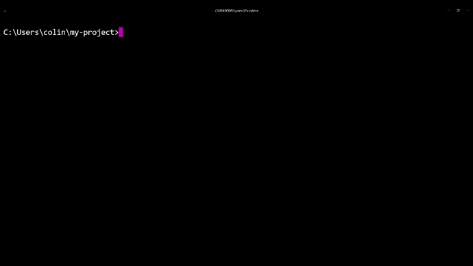

<div align="center">

# gasly

 

🏎💨 Quickly reuse snippets accross your project

</div>



---

## 🚚 Installation


```bash
# Yarn
yarn add gasly -D

# NPM
npm install gasly -D
```

## 🔎 Usage

### With a single file

First, create a directory named `.gasly` at the root of your project. Inside it, create a file which contains a snippet that you will often use, for example a react component written in Typescript:

```ts
/* .gasly/TsxComponent.tsx */
import { FC } from 'react';

type Props = {

};

const TsxComponent: FC<Props> = ({ }) => {
  return (
    <></>
  );
};

export default TsxComponent;
```

See how the component is named the same way as the file, this is important.

Then run:

```bash
npx gasly
```

...and choose the snippet you just created, the path where your new file will be located, and its name (ex: `TsxComponent.tsx`, `src/components`, `Navbar`). If everything worked as expected, you can now edit your new file 🎉 ! Notice how all the occurrences of the string `TsxComponent` where replaced by the name you chose.

### With a directory

The example above works exactly the same way with directories, if you want to divide a component in multiple files.

See [this example](./.gasly/DirectoryComponent).

## 📄 License

[MIT](./LICENSE) © Colin Lienard
